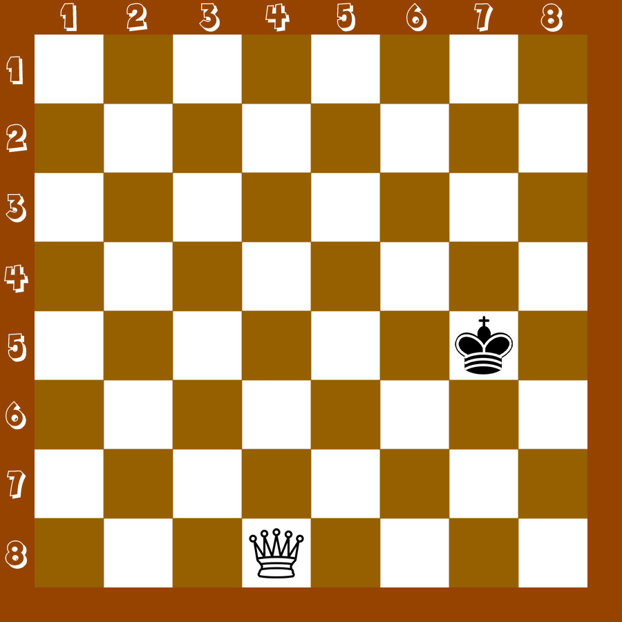

## Задание
- Написать функцию <b>queen</b>, которая возвращает булиновое значение: <b>true</b>, если белый ферзь бьёт вражескую фигуру. <b>false</b>, если не бьёт. 
- Функция принимает 4 аргумента:
    - x1: координата белого ферзя по оси x.
    - y1: координата белого ферзя по оси y.
    - x2: координата чёрной фигуры по оси x.
    - y2: координата чёрной фигуры по оси y.
- Задачу решить, не используя if / else, тернарный оператор, switch.

## Примеры
- (4, 8, 7, 5) => true
- (2, 2, 7, 2) => true
- (5, 1, 8, 3) => false
- (8, 1, 1, 8) => true

## Примечание
- Превью: 

## Справка
- Как ходят фигуры в шахматах: https://chess-boom.online/kak-hodyat-figury-v-shahmatah
